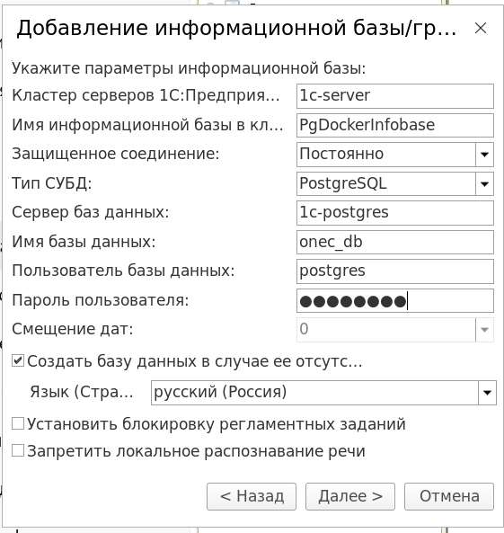

## 1С:Предприятие 8.3 клиент - сервер - Postgres 17 в Docker Compose

## Прочесть перед установкой!

Работа над репозиторием ~~к огромному сожалению~~ ещё не завершена. 
Готовых образов нет и, возможно, не будет из-за политики распространения 1С. 
Сборка дистрибутивов производится на вашей стороне. Все инструкции будут ниже.

На данный момент не удалось победить проблему лицензирования. 
А точнее раздачи лицензии сервером клиенту. Ресёрч в сети и использование ИИ не особо сдвинули процесс с мёртвой точки.

  
Конкретное описание проблемы с лицензированием

    
    Вне зависимости от способа получения лицензии для разработчика (community) вам понадобится GUI на сервере.
    Ни запуск моей [обработки для автоматического получения лицензий](ActivateCommunity.epf), ни
    фактическая активация через окно получения лицензии не помогли. По итогу всегда имеем следующую ошибку: 

    Не найдена лицензия. Не обнаружен ключ защиты программы или полученная программная лицензия!
    по причине:
    Поиск лицензии на клиенте:
    Файл программной лицензии не найден
    локальный ключ недоступен: Status=-100, ORGL8 Локальный, не установлен
    локальный ключ недоступен: Status=-100, ORG8A Локальный, не установлен
    локальный ключ недоступен: Status=-100, ORG8B Локальный, не установлен
    nethasp.ini: отсутствует, использованы настройки по умолчанию, ошибка соединения с менеджером лицензий: Net Status=0, System Error=0, Warning=15, ORGL8 Сетевой, не установлен
    nethasp.ini: отсутствует, использованы настройки по умолчанию, ошибка соединения с менеджером лицензий: Net Status=0, System Error=0, Warning=15, ORG8A Сетевой, не установлен
    nethasp.ini: отсутствует, использованы настройки по умолчанию, ошибка соединения с менеджером лицензий: Net Status=0, System Error=0, Warning=15, ORG8B Сетевой, не установлен
    Поиск лицензии на сервере:
    Лицензия для разработчиков не может быть выдана сервером клиентскому приложению Конфигуратор.
    Конфигурация не является базовой

    P.s. Естественно все chmod и chown расставлены корректно. Иначе в сообщении об ошибке была только информация
    о фактическом отсутсвии файла *.lic.

### Для чего и какие преимущества?

Образы, скрипты и обработка были созданы для "ленивого" деплоя и клиента, и сервера, 
и база данных с патчами от 1С на любом Linux хосте с установленным Docker Engine. На моёй рабочей машине 
это Fedora 42 с X11 графическим сервером. 

После всей автоматизации запуск сервера и клиента может осуществляться командами `docker compose up/down/start/etc`. 
См. [документацию Docker Compose](https://docs.docker.com/compose). При этом на сервере в автоматическом режиме 
будет (ну или по крайней мере должно) происходить получение лицензий раз в 6-7 дней (на данном этапе только при 
первом или повторном запуске контейнера, но можно усовершенствовать для zero downtime).

### Инструкция по сборке и запуску образов
- [Скачать исходный код](https://codeload.github.com/alexandermyasnikov123/onec-community-docker/zip/refs/heads/master) данного репозитория
- [Установить Docker](https://docs.docker.com/engine/install/) на вашу Linux систему
- Скачать [дистрибутив 1С:Предприятие 8.3](https://developer.1c.ru/applications/Console?state=community) с поддержкой community лицензии
- Скопировать из скачанного дистрибутива файл `setup-full-8.3*.run` в директорию `/путь/до/исходного-кода/my-onec-docker/distr/`
- Изменить в файле `.env` следующие значения переменных: 
  1. `PLATFORM_VERSION` (версия дистрибутива, которую вы загрузили ранее) 
  2. `DEV_LOGIN` (логин от портала разработчиков)
  3. `DEV_PASSWORD` (пароль от портала разработчиков)
- Дать права на выполнение скрипту [first_init.sh](first_init.sh): `chmod +x first_init.sh`
- При первом запуске выполнить скрипт [first_init.sh](first_init.sh) от имени администратора: `sudo ./first_init.sh`
- При дальнейших запусках можете просто использовать команды `xhost +local:docker && docker compose (up, start, stop, down, etc)` 

### Получение лицензии на сервере
Автоматизировано. Выполняется программно с помощью [внешней обработки](ActivateCommunity.epf) и [скриптов активации](1c-server).
Файл сохраняется в директорию `/var/1C/license` с корректными правами доступа. Однако, [есть проблема](#прочесть-перед-установкой).

Логи сохраняются в папку `/1c_dir/activation` в контейнере сервера. Вы можете посмотреть их, подключившись к контейнеру напрямую,
либо добавить точку монтирования/volume к этой директории. 

  
Основные логи выводятся в терминал и записываются в файлы

  
  

### Подключение к серверу

  
Данные для подключения к кластеру 1С:Предприятие из контейнера клиента

  Пароль пользователя базы данных: ***password***
  

### TODO:
1. Решить проблему с невозможностью выдачи сервером лицензии клиенту
2. Улучшить автоматизацию автоматического продления лицензии
3. Сделать свой образ Postgres-1C с более гибкой возможностью кастомизации credentials